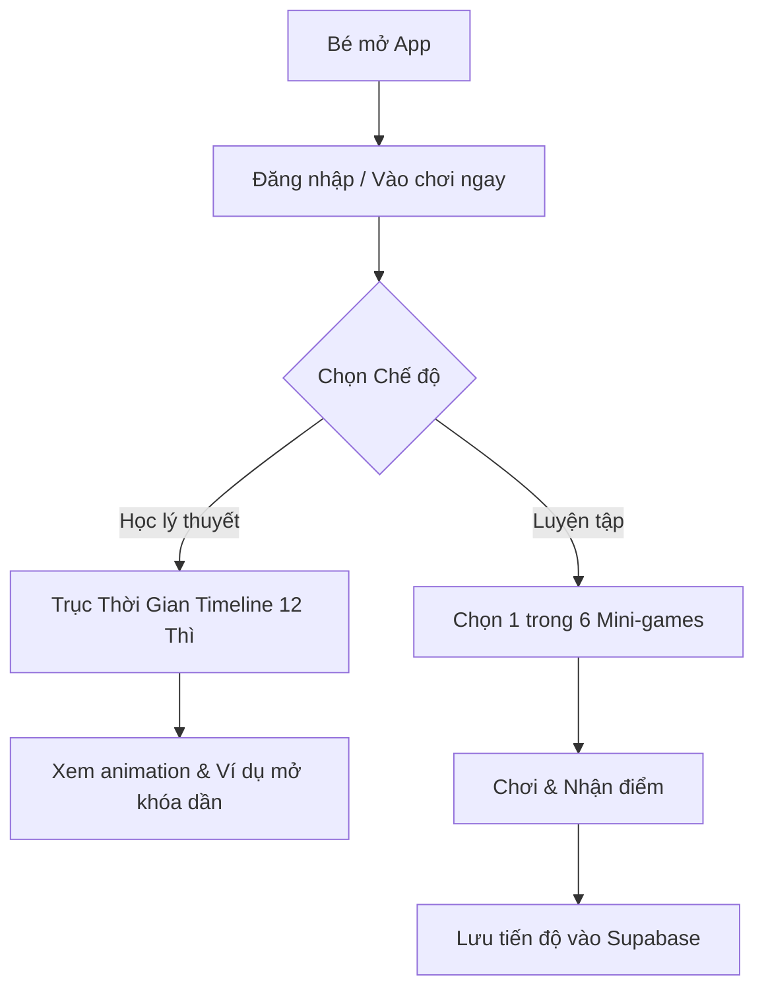

# Spec: Ứng dụng Học 12 Thì Tiếng Anh Cho Bé

## 1. Executive Summary
Web App tương tác giúp trẻ em 9 tuổi học 12 thì tiếng Anh dễ dàng thông qua Gamification (Trò chơi hóa) và trực quan hóa (Timeline). Tập trung vào "Phản xạ dấu hiệu" thay vì học vẹt.

## 2. User Stories
- Là một học sinh 9 tuổi, tôi muốn xem các thì trên một trục thời gian để dễ hình dung thứ tự trước sau thay vì đọc văn bản.
- Là một học sinh, tôi muốn chơi các mini-game (bắn tàu, kéo thả) để luyện phản xạ từ khóa nhận biết.
- Là một học sinh, tôi muốn hệ thống tự nhắc tôi những thẻ từ vựng tôi hay quên.
- Là phụ huynh, tôi muốn xem được thống kê sự tiến bộ của con mình qua từng bài học.

## 3. Database Design (Overview)
*Sẽ được thiết kế chi tiết ở bước /design.*
- **System**: Supabase PostgreSQL.
- **Tables dự kiến**: 
  - `users` (thông tin bé/phụ huynh).
  - `user_progress` (lưu điểm số các mini-game).
  - `flashcards_state` (lưu trạng thái thẻ nhớ của bé).

## 4. Logic Flowchart

## 5. API Contract
- Web app front-end tương tác trực tiếp qua Supabase Client SDK (BaaS layer). 
- Dùng Row Level Security (RLS) để bảo vệ dữ liệu nội bộ của người dùng.

## 6. UI Components
- Timeline 3D/Zoomable (có tính năng mở khóa dần để chống ngợp).
- Gamification Layout (Vùng kéo thả, Vật thể tự rơi, Bảng theo dõi điểm số).

## 7. Tech Stack
- Frontend: Next.js + React + TypeScript.
- Styling & Animation: TailwindCSS + Framer Motion (Rất quan trọng cho physics kéo thả).
- Backend & DB: Supabase (Auth, DB, Storage nếu cần hình ảnh).
- Hosting: Vercel.
